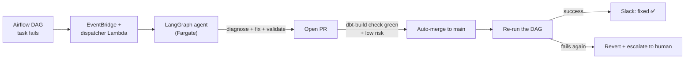

# dbt_ai_project

A [dbt](https://www.getdbt.com/) medallion-architecture project running against Databricks
(Unity Catalog / SQL Warehouse), orchestrated by Amazon MWAA (Airflow) — with a
**self-healing agent** that automatically diagnoses, fixes, and verifies the
mechanical class of pipeline failures (missing/renamed columns, broken
`ref()`/`source()` calls, simple compile errors) end to end, from an Airflow
DAG failure to a merged, re-verified fix on `main`, with no human in the loop
for the safe cases and a clean handoff to a human for everything else.



## Documentation

| Doc | What's in it |
| --- | --- |
| [`docs/ARCHITECTURE.md`](./docs/ARCHITECTURE.md) | Full system design, diagrams for every hop, the LangGraph state machine, guardrails, IAM/credential model |
| [`docs/SETUP.md`](./docs/SETUP.md) | Complete copy-pasteable runbook to build this whole system from zero in a fresh account |
| [`docs/OPERATIONS.md`](./docs/OPERATIONS.md) | Running the end-to-end test, watching a live run, resetting the circuit breaker, rotating secrets, troubleshooting every error hit while building this |
| [`docs/CONCEPTS.md`](./docs/CONCEPTS.md) | Plain-language explanations of every non-obvious concept used (LangGraph/ReAct, OIDC, OAuth M2M, circuit breaker, medallion architecture, ...) |
| [`agent/README.md`](./agent/README.md) | Agent code map + one-time setup checklist (component-level detail) |
| [`infra/README.md`](./infra/README.md) | Terraform mechanics: remote state bootstrap, required repo variables |

The rest of this file covers the **dbt project itself** — the pipeline the
agent protects, not the agent.

## Prerequisites

- Python 3.9+ (installed at `%LocalAppData%\Programs\Python\Python311` on this machine)
- Access to a Databricks workspace, SQL Warehouse (or cluster), and a personal access token

## Setup

1. Install dependencies:

   ```powershell
   python -m pip install -r requirements.txt
   ```

2. Configure your Databricks connection details. Copy `.env.example` to `.env` and fill in your values:

   ```powershell
   Copy-Item .env.example .env
   ```

   Then load them into your shell session:

   ```powershell
   Get-Content .env | ForEach-Object {
       if ($_ -match '^\s*([^#=]+)=(.*)$') {
           [System.Environment]::SetEnvironmentVariable($matches[1].Trim(), $matches[2].Trim())
       }
   }
   ```

   The connection profile lives at `~/.dbt/profiles.yml` (already created) and reads these environment variables:

   - `DBT_DATABRICKS_HOST` — workspace hostname, no `https://` (e.g. `adb-....azuredatabricks.net`)
   - `DBT_DATABRICKS_HTTP_PATH` — SQL Warehouse/cluster HTTP path
   - `DBT_DATABRICKS_TOKEN` — personal access token or service principal token
   - `DBT_DATABRICKS_CATALOG` — Unity Catalog name (optional, defaults to `hive_metastore`)
   - `DBT_DATABRICKS_SCHEMA` — target schema (optional, defaults to `dbt_ai_project_dev`)

   Never commit `.env` or real credentials to git — `.env` is already git-ignored.

3. Verify the connection:

   ```powershell
   dbt debug
   ```

4. Run the example models:

   ```powershell
   dbt run
   dbt test
   ```

## Project structure

This project follows a medallion architecture on top of the Databricks "Bakehouse" sample dataset (`ai_project.default`):

- **Bronze** — raw source tables, declared in `models/sources.yml` (`sales_customers`, `sales_franchises`, `sales_suppliers`, `sales_transactions`, `media_customer_reviews`). `media_gold_reviews_chunked` is declared as a source but intentionally not built on — it's a pre-chunked RAG/vector-search artifact, not raw business data.
- **Silver** (`models/silver/`, views in the `ai_project.silver` schema) — cleaned, deduplicated, and validated:
  - `silver_customers`, `silver_franchises`, `silver_suppliers` — standardized dimensions
  - `silver_transactions` — validated line items; card numbers masked to the last 4 digits, rows flagged if `total_price` doesn't reconcile with `quantity * unit_price`
  - `silver_customer_reviews` — cleaned review text with a star rating parsed out of free text where present, bucketed into Positive/Neutral/Negative/Unrated
- **Gold** (`models/gold/`, tables in the `ai_project.gold` schema) — business marts:
  - `gold_dim_customers`, `gold_dim_suppliers`, `gold_dim_franchises`, `gold_fact_sales` — star schema for BI tools
  - `gold_franchise_performance` — monthly revenue/orders/AOV per franchise plus each franchise's top product
  - `gold_customer_ltv` — lifetime value, recency status (Active/At Risk/Churned), and value segment
  - `gold_product_performance` — chain-wide revenue mix and ranking by product
  - `gold_review_sentiment` — reputation scorecard per franchise from parsed review ratings

- `seeds/`, `snapshots/`, `macros/`, `analyses/`, `tests/` — standard dbt directories
- `macros/get_custom_schema.sql` — makes `+schema: silver` / `+schema: gold` land in `ai_project.silver` / `ai_project.gold` directly, rather than dbt's default `<target_schema>_<custom_schema>` naming
- `dbt_project.yml` — project configuration
- `requirements.txt` — pinned Python dependencies (`dbt-core`, `dbt-databricks`)
- `scripts/explore_schema.py` — ad hoc helper to list tables/columns/samples in the configured Databricks schema (reads credentials from environment variables, no secrets stored)
- `dags/`, `profiles/profiles.yml`, `mwaa/` — Airflow/MWAA orchestration, see below

## Orchestration (Airflow / Amazon MWAA)

Two DAGs in `dags/` run the medallion pipeline:

- **`dbt_silver`** — runs `dbt run --select silver` then `dbt test --select silver` on a daily schedule (`0 6 * * *`), then triggers `dbt_gold`.
- **`dbt_gold`** — runs `dbt run --select gold` then `dbt test --select gold`. It has no schedule of its own (`schedule=None`) — it's only triggered by `dbt_silver`, so gold always builds on fresh silver data instead of racing a fixed clock offset. It can still be triggered manually for backfills.

`dags/dbt_common.py` holds shared config: it resolves the dbt project/profiles
paths relative to the DAG file, runs dbt from the MWAA startup-script venv
when present, and loads Databricks credentials from MWAA **Airflow
configuration options** (`dbt.databricks_host`, etc. → `AIRFLOW__DBT__*`
env vars on workers). Locally the same code falls back to `DBT_DATABRICKS_*`
environment variables.

**Why a separate `profiles/profiles.yml`:** MWAA workers don't have your local `~/.dbt/profiles.yml`, so a copy that only references `env_var(...)` (no literal secrets — safe to commit) is deployed alongside the DAGs and pointed to via `--profiles-dir`.

**Why a separate dbt virtualenv (`mwaa/startup.sh`):** dbt-core's pinned dependencies (click, jinja2, pydantic, etc.) commonly conflict with the versions MWAA pins for Airflow itself. Rather than fighting that in the environment's `requirements.txt`, `mwaa/startup.sh` creates an isolated virtualenv (`/usr/local/airflow/dbt_venv`) and installs `dbt-core`/`dbt-databricks` there; the DAGs call that venv's `dbt` binary directly.

### Deploying to MWAA

1. Sync this whole repo to your MWAA environment's S3 `dags/` prefix (so `dbt_project.yml`, `models/`, `macros/`, `profiles/` sit alongside the DAG `.py` files — the GitHub Actions workflow does this on push to `main`).
2. Upload `mwaa/startup.sh` to S3 and set it as the environment's **Startup script file** (with its S3 object version).
3. Point the environment's **Requirements file** at `mwaa/requirements.txt` (no extra packages needed today beyond what MWAA bundles).
4. In the AWS MWAA console → environment → **Edit** → **Next** → **Airflow configuration options** → **Add custom configuration**, set:
   - `dbt.databricks_host`
   - `dbt.databricks_http_path`
   - `dbt.databricks_token`
   - `dbt.databricks_catalog`
   - `dbt.databricks_schema`
5. Unpause `dbt_silver` (and `dbt_gold`, though it only runs when triggered) in the Airflow UI.

> Note: Airflow Admin → Variables are *not* reliably readable from MWAA Airflow 3 workers for this setup. Prefer the Airflow configuration options above.

### Testing locally

```powershell
dbt run --project-dir . --profiles-dir .\profiles --select silver --target prod
dbt run --project-dir . --profiles-dir .\profiles --select gold --target prod
```

These are exactly the commands the DAGs run under the hood (both verified against Databricks while building this).

## Self-healing agent

`agent/`, `dispatcher/`, and `infra/` implement the automated failure-recovery
system diagrammed above — see [`docs/ARCHITECTURE.md`](./docs/ARCHITECTURE.md)
for the full design and [`docs/SETUP.md`](./docs/SETUP.md) to build your own.
In short: an `on_failure_callback` on every dbt task (`dags/dbt_common.py`)
publishes an EventBridge event on failure, a dispatcher Lambda starts a
LangGraph agent on Fargate (guarded by a per-day circuit breaker), the agent
diagnoses the dbt error against the real Airflow log and Databricks schema,
proposes and validates a fix against an isolated `ci` target
(`profiles/profiles.yml`), opens a PR, and — only if the same `dbt-build`
check that gates human PRs passes and the diff is small/well-understood —
auto-merges and re-runs the DAG to confirm the fix actually worked.

## Useful commands

| Command | Description |
| --- | --- |
| `dbt debug` | Test the Databricks connection |
| `dbt run` | Run all models |
| `dbt test` | Run all tests |
| `dbt build` | Run + test seeds, models, and snapshots |
| `dbt docs generate && dbt docs serve` | Generate and view project documentation |
