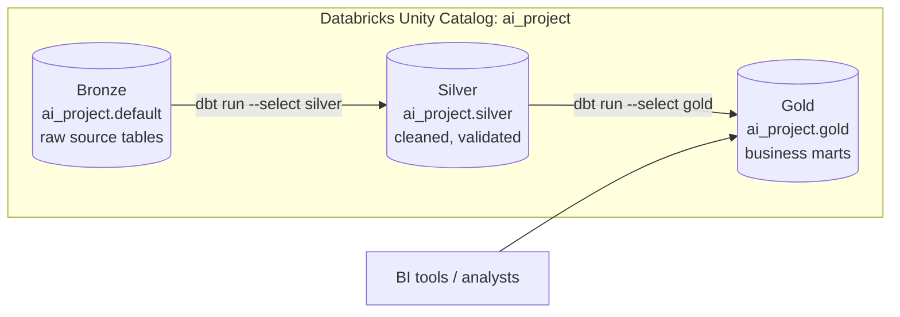
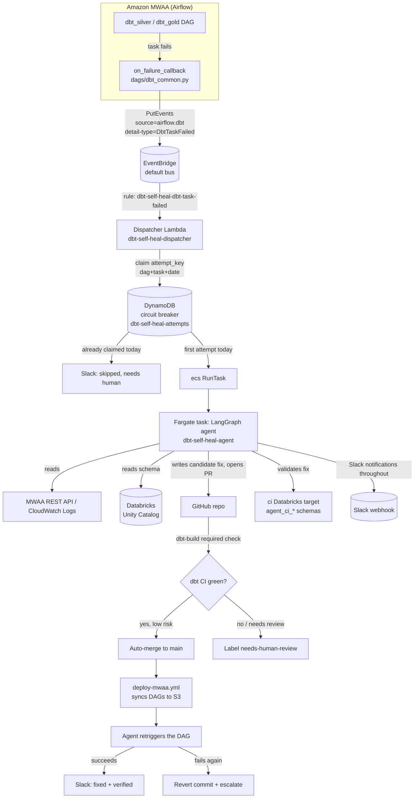
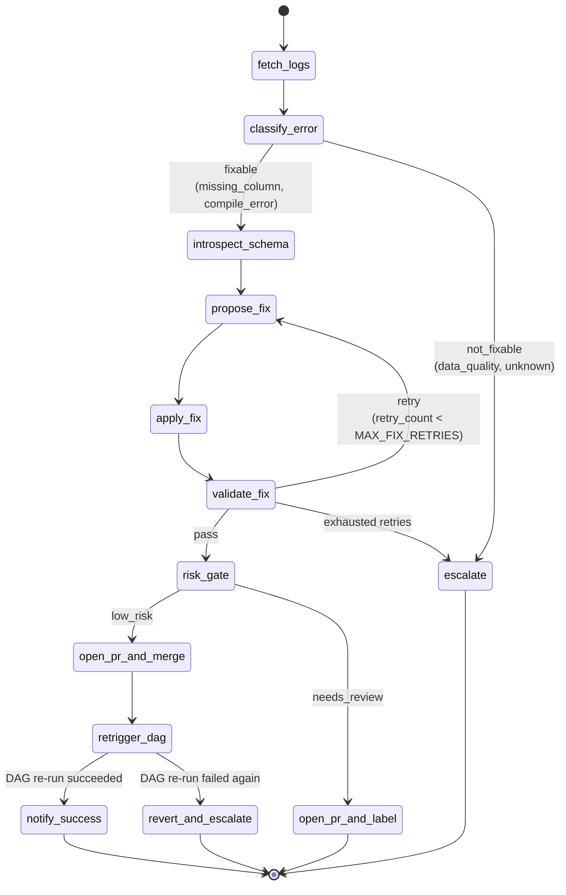
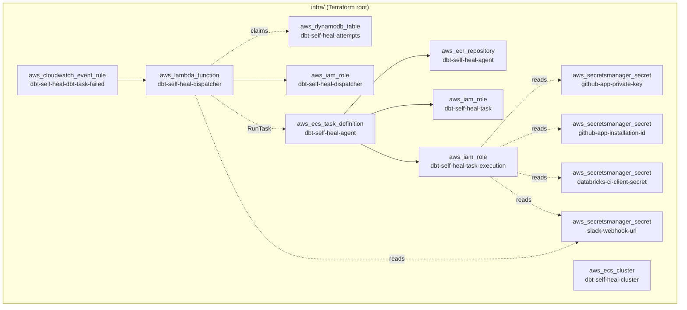
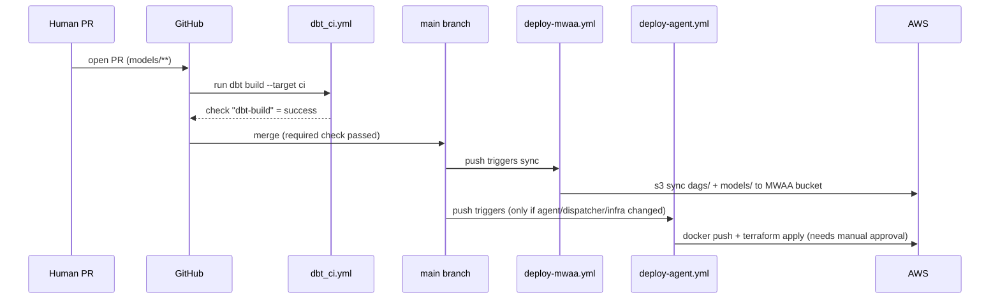

# Architecture

This document explains **what the self-healing dbt pipeline is built from and why**.
For **how to build it step by step**, see [`SETUP.md`](./SETUP.md). For day-2
operations (testing, debugging, rollback), see [`OPERATIONS.md`](./OPERATIONS.md).
For background on the individual technologies/patterns used, see [`CONCEPTS.md`](./CONCEPTS.md).

## 1. The problem this solves

A dbt project running on a schedule in Airflow will eventually fail — someone
renames a source column, a model references something that no longer exists,
a test starts catching real bad data. Normally that means: an on-call human
gets paged, opens the Airflow log, reads the dbt error, figures out the fix,
opens a PR, waits for CI, merges, and re-runs the DAG. That whole loop is
mechanical for a large class of failures (missing/renamed columns, broken
`ref()`/`source()` calls, simple compile errors) — which makes it a good fit
for an agent, **as long as it can't silently corrupt production data or
merge something unsafe.**

This project wires an AI agent into that loop so it runs *automatically* for
the mechanical cases, while still going through the exact same PR + CI gate a
human would, and stepping out of the way (paging a human instead) for
anything it can't safely handle.

## 2. Data architecture: the medallion pipeline being protected

- **Bronze** — raw tables as landed (`sales_customers`, `sales_transactions`, `media_customer_reviews`, ...).
- **Silver** — deduplicated, validated, standardized (masked card numbers, reconciled totals, parsed ratings).
- **Gold** — star-schema marts and business aggregates BI tools query directly.

Two Airflow DAGs drive this: `dbt_silver` (scheduled) triggers `dbt_gold` on
success, so gold always builds on fresh silver instead of racing a fixed
clock offset.

## 3. Self-healing system, end to end

Every arrow above is a real AWS/GitHub/Databricks API call — nothing here is
simulated. The sections below walk through each hop.

### 3.1 Failure detection (Airflow → EventBridge)

`dags/dbt_common.py` attaches `notify_self_heal_agent` as the
`on_failure_callback` on every dbt task (`DEFAULT_DBT_ARGS`). When a task
fails, this callback fires **inline on the Airflow worker's failure path**,
so it's deliberately minimal: it publishes one `PutEvents` call to
EventBridge's default bus with `dag_id`, `task_id`, `run_id`, `try_number`,
and `log_url` — just enough to *locate* the failure. It never raises (a
broken notifier must not turn one failed task into a scheduler-wide
problem), and no-ops with a log line if `boto3`/credentials aren't available,
so the exact same DAG code runs locally without the AWS stack.

### 3.2 Dispatch + circuit breaker (EventBridge → Lambda → Fargate)

An EventBridge rule (`dbt-self-heal-dbt-task-failed`) matches on
`source=airflow.dbt`, `detail-type=DbtTaskFailed` and targets the
`dbt-self-heal-dispatcher` Lambda. The dispatcher does almost nothing on
purpose:

1. **Circuit breaker.** Atomically `PutItem` a DynamoDB row keyed
   `{dag_id}#{task_id}#{yyyy-mm-dd}` with a conditional expression
   (`attribute_not_exists`). If the row already exists, an attempt already
   ran today for this exact dag+task — skip starting the agent and just post
   a Slack heads-up. **This is what stops a fix that doesn't actually work
   from re-triggering itself into an infinite fix → fail → re-fix loop.**
2. Otherwise, `ecs.RunTask` one Fargate task from the `dbt-self-heal-agent`
   task definition, passing the failure context in as container environment
   **overrides** (`FAILURE_DAG_ID`, `FAILURE_TASK_ID`, `FAILURE_RUN_ID`,
   `FAILURE_TRY_NUMBER`, `FAILURE_LOG_URL`).

All the actual diagnosis/fix/merge logic lives in the agent container, not
here — the dispatcher's only job is "should we start it, and if so, start it."

### 3.3 The LangGraph agent

The agent is a run-to-completion Fargate task (not a long-lived service):
`agent/main.py` reads the `FAILURE_*` env vars, builds and invokes the graph
once, prints the final state, and exits. See [§4](#4-the-langgraph-state-machine)
for the graph itself.

### 3.4 The hard backstop: PR + required CI check

Even a fix the agent is confident about never lands on `main` directly.
`nodes/open_pr_and_merge.py` always:

1. Pushes a branch and opens a real PR (`nodes/_pr_common.py`, via a GitHub
   App installation token — see [§5](#5-identity--credentials)).
2. Polls the GitHub Checks API and **waits for the exact same `dbt-build`
   check** that gates human PRs (`.github/workflows/dbt_ci.yml`) to go green
   on that PR's head commit.
3. Only if that check passes *and* `risk_gate` said `low_risk` does it call
   `merge_pull_request`. If the check fails or times out, it labels the PR
   `needs-human-review` instead — never force-merges.

This means a bug in the agent's own risk-scoring logic **cannot** bypass CI:
GitHub's own required-status-check mechanism is the actual gate, the
agent's risk_gate is just a filter for *which* green PRs get merged without
a human looking at them first.

### 3.5 Verifying the fix actually worked

Merging the PR isn't the finish line. `nodes/retrigger_dag.py` re-runs the
same Airflow DAG that originally failed. If it succeeds, `notify_success`
posts to Slack and the run ends in `fixed_and_verified`. If it fails again,
`revert_and_escalate` **reverts the merge commit on `main`** and pages a
human — the system is designed to never leave `main` in a broken state, even
if a fix looked right in isolated CI but didn't actually resolve the
production failure.

## 4. The LangGraph state machine

`agent/graph.py` wires every node in `agent/nodes/` into a
[`StateGraph`](https://langchain-ai.github.io/langgraph/) over a single
`SelfHealState` `TypedDict` (`agent/state.py`) that accumulates fields as it
flows through the graph — this is the audit trail: the full state is
logged at the end of every run.

| Node | Job |
| --- | --- |
| `fetch_logs` | Pull the failing task's log from the MWAA REST API (`airflow:CreateWebLoginToken`) with a CloudWatch Logs fallback. |
| `classify_error` | Ask Bedrock (Claude) to classify the dbt error into `missing_column` / `compile_error` / `data_quality` / `unknown`, and extract the affected model/column. |
| `introspect_schema` | `DESCRIBE TABLE` the relevant upstream source/model in Databricks so the model has ground truth on what columns actually exist. |
| `propose_fix` | Ask Bedrock for a patched version of the model file(s), given the log, schema context, and (on retry) a summary of why previous attempts failed. |
| `apply_fix` | Write the proposed file(s) into an isolated git clone, restricted to `models/` (`tools/repo_tools.py`). |
| `validate_fix` | Run `dbt build --target ci` against the isolated `agent_ci*` schemas. |
| `risk_gate` | Score the diff: files changed, lines changed, error type, and touched paths against an allow-list. Any single failing check routes to `needs_review`. |
| `open_pr_and_merge` | Push, open PR, wait for the required `dbt-build` check, merge if green. |
| `open_pr_and_label` | Push, open PR, label `needs-human-review`, stop — a human takes it from here. |
| `retrigger_dag` | Trigger a fresh run of the DAG that originally failed. |
| `notify_success` / `escalate` / `revert_and_escalate` | Terminal nodes — Slack notification + final state. |

### Guardrails at a glance

| Guardrail | Where enforced |
| --- | --- |
| Agent can never write outside `models/` | `tools/repo_tools.py` (code, not a prompt instruction) |
| Agent can never touch prod Databricks data | Isolated `ci` target + dedicated `agent_ci*`-scoped service principal |
| Fix attempts are bounded | `graph.py::route_validation` + `config.MAX_FIX_RETRIES` (default 3) |
| Auto-merge only for small, well-understood diffs | `nodes/risk_gate.py` + `config.LOW_RISK_MAX_FILES` / `LOW_RISK_MAX_LINES` / `LOW_RISK_ERROR_TYPES` |
| Agent's own risk score is never trusted alone | `nodes/open_pr_and_merge.py` still requires the real `dbt-build` GitHub check to be green |
| At most one auto-fix attempt per dag+task per day | Dispatcher Lambda's DynamoDB circuit breaker |
| `main` is never left broken | `nodes/revert_and_escalate.py` |

## 5. Identity & credentials

Every hop uses the narrowest credential that can do the job — no shared
static secrets, nothing more privileged than it needs to be.

| Actor | Credential | Scope |
| --- | --- | --- |
| GitHub Actions (`deploy-mwaa.yml`, `deploy-agent.yml`) | OIDC → assumed IAM role (`GithubActions-*` role, no long-lived AWS keys stored in GitHub) | Scoped to this repo's resources only (`dbt-self-heal-*` ARN prefixes) |
| Agent's GitHub access | A dedicated **GitHub App** installed only on this repo, private key in Secrets Manager | Contents (r/w), Pull requests (r/w), Checks (read) — nothing else, and only on one repo |
| Agent's Databricks CI access | A dedicated **service principal**, OAuth **M2M** (client id + secret), not a shared personal access token | `SELECT` on the bronze source schema, `ALL PRIVILEGES` on `agent_ci_silver`/`agent_ci_gold` only — zero access to real `silver`/`gold` |
| Agent's AWS access | ECS task IAM role (`dbt-self-heal-task`) | Bedrock invoke, MWAA read-only + trigger, its own DynamoDB row, its own log group — nothing broader |
| Agent's LLM access | Bedrock, via the task role (no API key) | `bedrock:InvokeModel` on the Claude inference profile only |

See [`CONCEPTS.md`](./CONCEPTS.md#oidc-vs-static-aws-keys) and
[`CONCEPTS.md`](./CONCEPTS.md#oauth-m2m-machine-to-machine) for *why* these
choices, and [`SETUP.md`](./SETUP.md) for the exact commands that create them.

## 6. AWS resource map

Everything the agent needs lives under Terraform in `infra/`, all prefixed
`dbt-self-heal-*` (configurable via `var.project_name`) so it's trivially
identifiable/removable independent of any other infra in the account.

## 7. CI/CD pipelines

Three independent GitHub Actions workflows, each triggered by different
path filters on push to `main` (or on PR for the first one):

| Workflow | Trigger | Does |
| --- | --- | --- |
| `dbt_ci.yml` | PR touching `dags/`, `models/`, `macros/`, `seeds/`, `snapshots/`, `analyses/`, `tests/`, `profiles/`, `dbt_project.yml` | Runs `dbt build --target ci` against the isolated schema. Its check name (`dbt-build`) is the required branch-protection check and the one the agent polls before merging. |
| `deploy-mwaa.yml` | push to `main` touching the same dbt paths + `mwaa/` | Syncs the dbt project + DAGs to the MWAA S3 `dags/` prefix; re-points MWAA at new `requirements.txt`/`startup.sh` S3 object versions if they changed. |
| `deploy-agent.yml` | push to `main` touching `agent/`, `dispatcher/`, `infra/` | Builds+pushes the agent Docker image to ECR, then `terraform apply`s `infra/`. Gated behind the `agent-deploy` GitHub **environment** requiring manual approval — deliberately, since this can touch IAM/ECS/Lambda. |

## Next steps

- Building this from zero: [`SETUP.md`](./SETUP.md)
- Testing, debugging, and running this day to day: [`OPERATIONS.md`](./OPERATIONS.md)
- Unfamiliar terms (OIDC, OAuth M2M, ReAct, circuit breaker, etc.): [`CONCEPTS.md`](./CONCEPTS.md)
